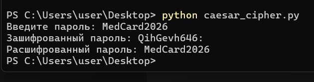

# MedicalCard Security – Caesar Cipher

Учебный проект по дисциплине "Информационная безопасность".

## Алгоритм
Реализован классический шифр Цезаря со сдвигом 4.

## Пример работы

Исходный пароль:
MedCard2026

Зашифрованный:
QihGevh646:

Расшифрованный:
MedCard2026

## Скриншот

